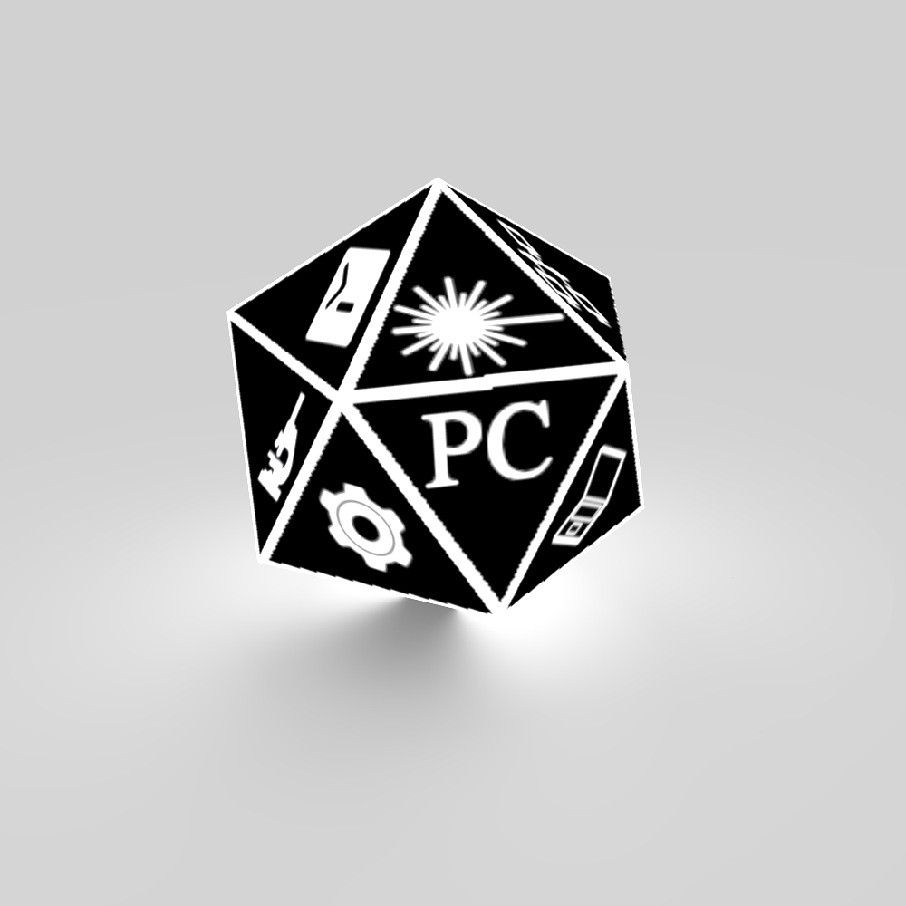

  

  <h3 align="center">ProberControl</h3>

 

The goal of the prober control software is to deliver a framework that can be used to execute automated tests on different hardware setups. The prober control features a clear structure on how to bind-in and access new tools and methodologies.

The prober controller will provide a clear mechanism for integrating switches (independent of the nature of the switch) in a test setups and how to assign signals lucid to the IOs where they are needed. The prober controller will provide a transparent system on reflecting the connected probe inside the code.

## Contributing

Guidelines for contributing

## Community

Community Information

## Versioning
Version information

## Creators

**Robert Polster**
- [Contact](mailto:rpp2130@columbia.edu)

**Graham Philip Patterson**
- [Contact](mailto:gpp2109@columbia.edu)
- [GitHub](https://github.com/pattersongp)

**Michail Oikonomou**
- [Contact](mailto:mo2617@columbia.edu)

## Copyright and license

Copyright (C) 2017  Robert Polster

This program is free software: you can redistribute it and/or modify
it under the terms of the GNU General Public License as published by
the Free Software Foundation, either version 3 of the License, or
(at your option) any later version.

This program is distributed in the hope that it will be useful,
but WITHOUT ANY WARRANTY; without even the implied warranty of
MERCHANTABILITY or FITNESS FOR A PARTICULAR PURPOSE.  See the
GNU General Public License for more details.

You should have received a copy of the GNU General Public License
along with this program.  If not, see <http://www.gnu.org/licenses/>.

